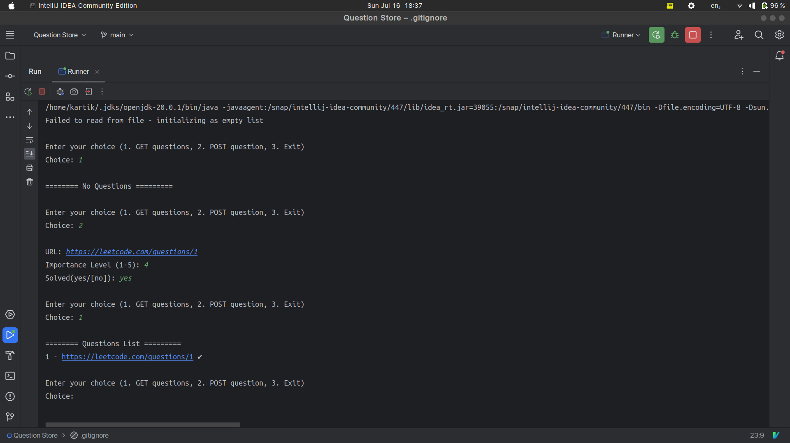
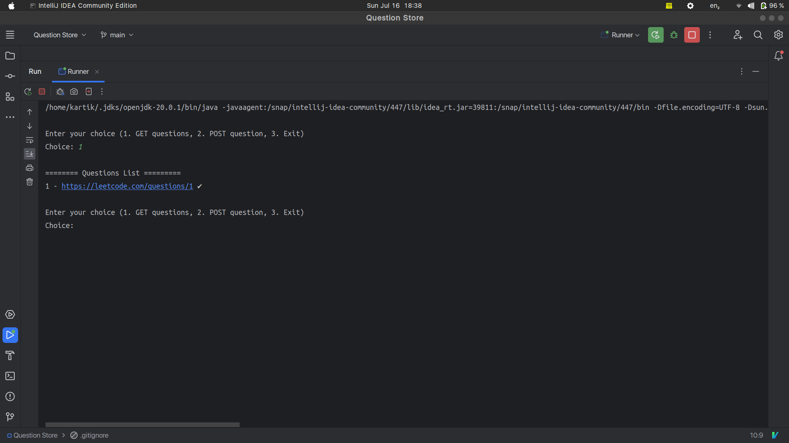

# learning-jackson

- Menu-driven program that allows users to add URL's of the important leetcode questions and view them.
- Data persistence is done, by saving the list of questions into a JSON file.
- Jackson library is used for serialization and deserialization of the data.

## Screenshots

1. On the first run of program, if we try to list out the questions, then the list is empty. We can add new question

2. On re-run, we can see the list of questions that we added in the last run.

